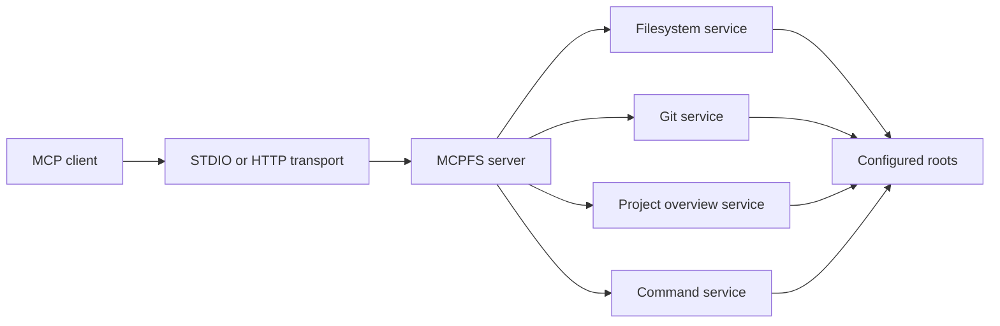
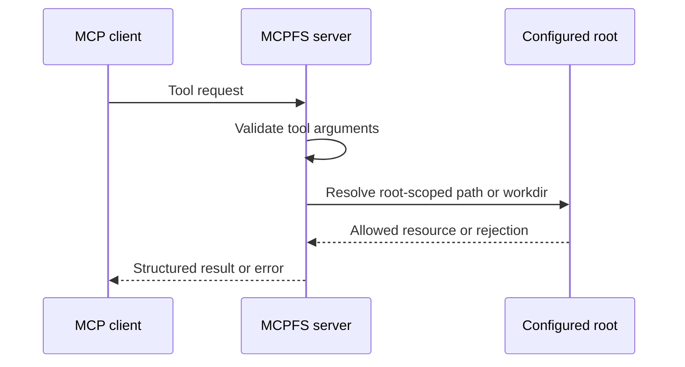
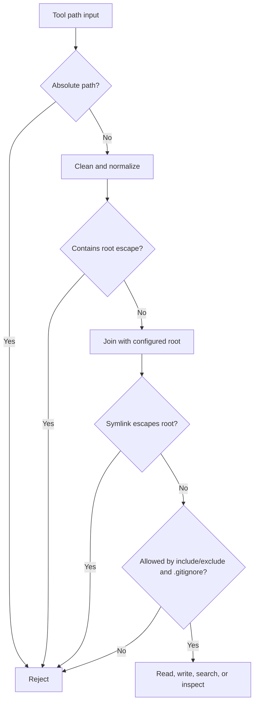
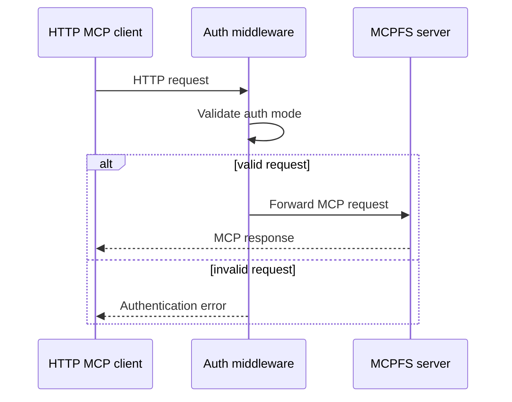

# Architecture

MCPFS is a local or self-hosted MCP server. It exposes project context through a small set of configured capabilities instead of broad filesystem access.

## Overview

At runtime, MCPFS loads a server config, registers MCP tools, and serves requests over STDIO, HTTP, or HTTP with an embedded ngrok tunnel.

## Components

### Server config

The server config defines:

- server name and version;
- transport mode;
- HTTP bind address and path;
- HTTP auth mode;
- configured roots;
- command execution mode and command items.

### Filesystem service

The filesystem service handles root listing, directory listing, tree output, file reads, line-range reads, search, regex search, file metadata, and optional writes.

### Git service

The Git service exposes read-only Git metadata such as status, diffs, logs, commits, and blame.

### Project overview service

The project overview service returns a bounded summary of a configured root, including tree text, important files, counts, Git status, and recent commits.

### Command service

The command service exposes command execution only when enabled by `commands.mode`.

## Runtime flow

## Root resolution and path safety

MCPFS tool paths are interpreted relative to configured roots. The server rejects root escapes before accessing files.

For write operations, MCPFS also checks existing parent directories before creating new files so a write cannot escape through a parent symlink.

## Permission boundaries

Filesystem writes are opt-in per root. Command execution is opt-in at the server command level.

- Root `mode: "read"` permits inspection only.
- Root `mode: "read_write"` permits `fs_write` inside that root.
- `commands.mode: "disabled"` registers no command tools.
- `commands.mode: "predefined"` registers allowlisted command execution.
- `commands.mode: "unguarded"` exposes arbitrary argv execution.

## HTTP and auth layer

For HTTP transports, MCPFS can validate requests with no auth, bearer auth, or OIDC/JWT auth.

## Design trade-offs

MCPFS favors explicit operator control over automatic discovery.

- Roots must be configured.
- Writes must be opted into per root.
- Command execution must be opted into separately.
- Remote access requires deliberate transport and auth configuration.

This keeps the trust boundary visible and makes unsafe configurations reviewable in plain JSON.
