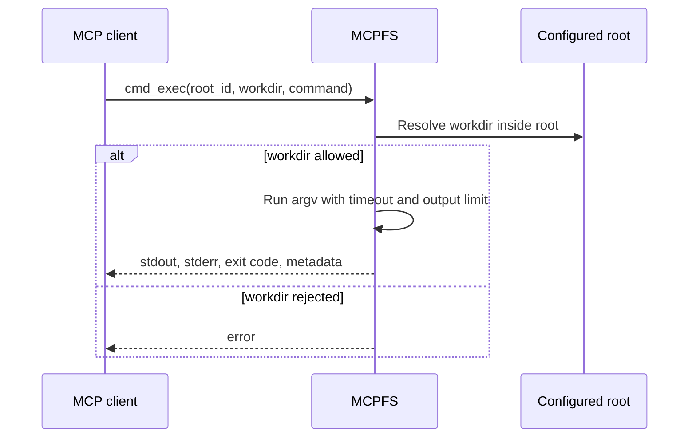

# Commands

MCPFS can expose command execution to MCP clients. Command execution is disabled by default and should stay disabled unless you need it.

## Command modes

| Mode | Registered tools | Behavior |
| --- | --- | --- |
| `disabled` | None | No command execution tools are registered. |
| `predefined` | `cmd_list`, `cmd_run` | Clients can list and run configured command IDs. |
| `unguarded` | `cmd_list`, `cmd_run`, `cmd_exec` | Clients can run configured commands and arbitrary argv commands. |

Prefer `predefined` when command execution is needed.

## Predefined commands

Predefined commands use fixed argv arrays in the MCPFS config.

Example:

```json
"commands": {
  "mode": "predefined",
  "defaults": {
    "timeout_seconds": 60,
    "max_output_bytes": 65536
  },
  "items": [
    {
      "id": "test",
      "description": "Run all Go tests",
      "root_id": "project",
      "workdir": ".",
      "command": ["go", "test", "./..."],
      "timeout_seconds": 120
    }
  ]
}
```

With this config, an MCP client can call `cmd_run` with:

```json
{
  "id": "test"
}
```

## Unguarded commands

`commands.mode: "unguarded"` registers `cmd_exec`. This lets a connected MCP client provide an arbitrary argv array.

Treat this as terminal-level authority inside the configured root-scoped working directory.



Do not expose unguarded command execution to remote or untrusted clients.

## Shell behavior

`cmd_run` and `cmd_exec` execute argv arrays directly. MCPFS does not perform shell interpolation unless the configured or client-provided argv explicitly invokes a shell such as `sh`, `bash`, or `powershell`.

## Timeouts and output limits

Commands can define:

- timeout in seconds;
- maximum combined stdout/stderr output bytes.

MCPFS returns structured metadata for stdout, stderr, exit code, duration, timeout, and truncation.

## Safer command selection

Good predefined command candidates:

- test commands;
- format checks;
- lint checks;
- read-only diagnostic commands;
- build commands that do not publish or deploy.

Avoid commands that:

- publish packages;
- deploy infrastructure;
- rotate or print secrets;
- modify global machine state;
- install arbitrary remote scripts;
- delete broad directories;
- invoke a shell with unreviewed input.

## Related docs

- [Security](security.md)
- [Add predefined commands](how-to/add-predefined-commands.md)
- [Command execution](advanced/command-execution.md)
- [MCP tools reference](reference/tools.md)
