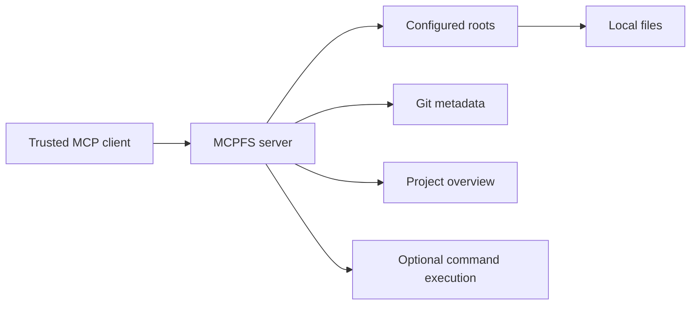
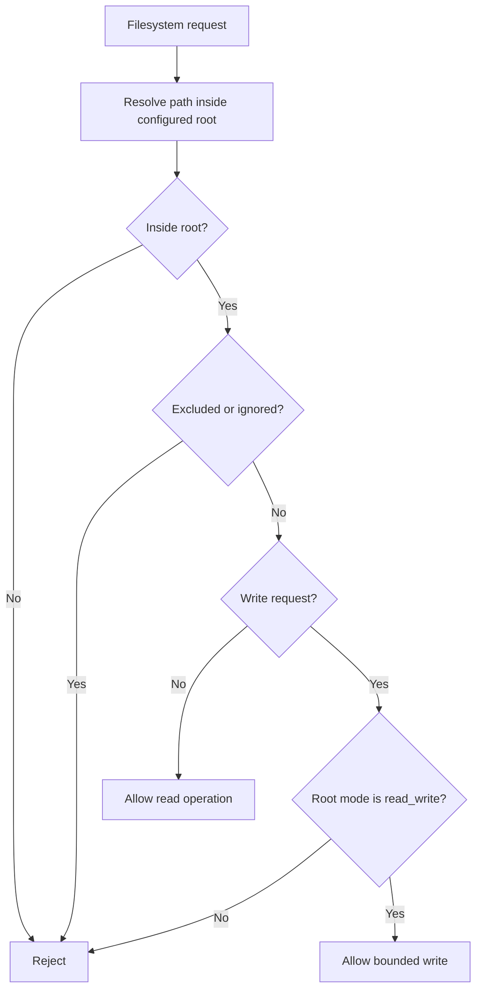
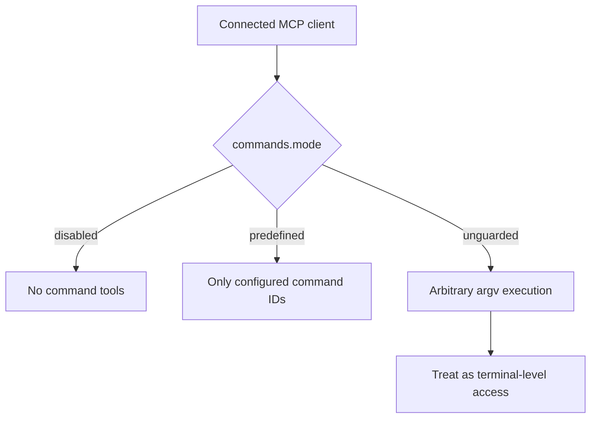

# Security

MCPFS is security-sensitive software. It gives MCP clients controlled access to local project files, Git metadata, project summaries, optional writes, and optional command execution.

Treat access to an MCPFS server like access to the configured project roots. When writes or command execution are enabled, treat access like terminal-level authority inside those roots.

## Trust boundaries

MCPFS sits between an MCP client and local project resources.

The most important security question is whether you trust the connected MCP client with the capabilities you configured.

## Recommended starting point

Start with:

- local STDIO transport;
- narrow project roots;
- `mode: "read"` roots;
- `commands.mode: "disabled"`;
- no HTTP exposure;
- no ngrok tunnel.

Enable additional capabilities only when you need them.

## Local-only use

Local STDIO is the recommended default for first use. It avoids exposing MCPFS on a network port.

Local-only use still requires trust. A connected MCP client can read whatever the configured roots allow. Keep roots narrow and avoid directories that contain secrets.

## Remote HTTP use

HTTP transport is useful when a client needs to connect to a network endpoint. It also increases exposure.

For HTTP transport:

- bind to `127.0.0.1` unless remote access is required;
- use `auth.mode: "bearer"` or `auth.mode: "oidc"` for network access;
- use TLS or a trusted reverse proxy for remote deployments;
- avoid writable roots unless required;
- avoid unguarded command execution;
- review logs for accidental secret exposure.

Do not expose MCPFS to untrusted networks with `auth.mode: "none"`.

## Bearer auth

Bearer auth uses a shared token from an environment variable.

Use bearer auth for simple HTTP deployments where every trusted client can share the same token.

Recommended practices:

- generate a high-entropy token;
- store it in an environment variable or secret manager;
- do not commit it to Git;
- rotate it if exposed;
- avoid logging it;
- use TLS for remote HTTP.

## OIDC auth

OIDC auth validates bearer JWTs issued by an external identity provider. MCPFS validates the configured issuer, audience, JWKS signature, expiry, not-before time when present, and identity allowlists.

Use OIDC when you want identity-provider-backed access instead of a shared static token.

Recommended practices:

- validate the expected issuer;
- validate the expected audience;
- configure `allowed_emails` or `allowed_subjects`;
- do not disable signature or expiry validation;
- test missing, invalid, and valid tokens before production use.

## Read and read/write roots

Roots are read-only by default. A root configured with `mode: "read"` can be inspected but not written.

A root configured with `mode: "read_write"` enables `fs_write` inside that root, subject to root boundary, include/exclude, `.gitignore`, symlink, and size-limit checks.

Use `read_write` only for narrow roots that you are comfortable modifying.

## Command modes

Command execution is controlled by `commands.mode`.

| Mode | Behavior |
| --- | --- |
| `disabled` | No command execution tools are registered. This is the safest default. |
| `predefined` | Registers `cmd_list` and `cmd_run`. Only configured command IDs can run. |
| `unguarded` | Registers `cmd_list`, `cmd_run`, and `cmd_exec`. Clients can run arbitrary argv commands. |

Prefer `predefined` when command execution is needed.

`cmd_run` and `cmd_exec` execute argv arrays directly. They do not perform shell interpolation unless the configured or client-provided argv explicitly invokes a shell.

## Unsafe configurations

Avoid these configurations unless you fully understand and accept the risk:

- broad roots such as a home directory;
- `read_write` access to directories containing secrets;
- HTTP bound publicly with `auth.mode: "none"`;
- long-lived bearer tokens stored in committed files;
- ngrok tunnels with writable roots and no auth;
- `commands.mode: "unguarded"` exposed to remote clients;
- OIDC configs that do not validate issuer, audience, and identity allowlists.

## Production hardening checklist

Before using MCPFS in a production-like environment:

- Use the narrowest practical roots.
- Keep roots read-only unless writes are required.
- Use `read_write` only for reviewed directories.
- Keep command execution disabled unless required.
- Prefer predefined commands over unguarded commands.
- Require bearer or OIDC auth for HTTP.
- Use TLS or a trusted reverse proxy for remote HTTP.
- Store tokens and identity-provider settings outside committed files.
- Validate OIDC issuer, audience, expiry, signature, and identity allowlists.
- Avoid exposing ngrok tunnels longer than needed.
- Review logs and example configs for secrets.
- Run tests after security-sensitive changes.

## Vulnerability reporting boundaries

Report vulnerabilities privately through GitHub Security Advisories if available, or contact the maintainer directly.

Do not open public issues for vulnerabilities that could put users at risk.

Intentional unsafe configurations that are clearly documented as unsafe are not automatically vulnerabilities. Examples include enabling `commands.mode: "unguarded"` or exposing HTTP with `auth.mode: "none"` in an environment you control. Security issues may still exist if MCPFS fails to enforce documented boundaries, such as root containment, auth validation, or write-mode checks.
